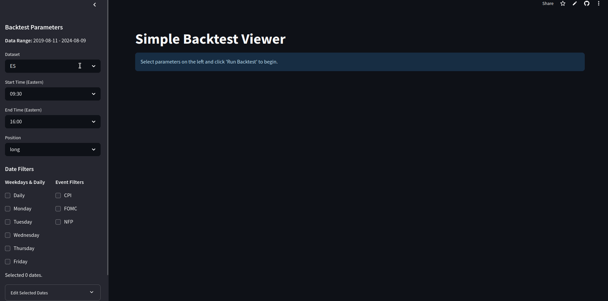
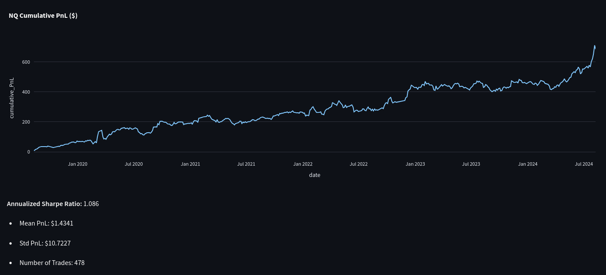
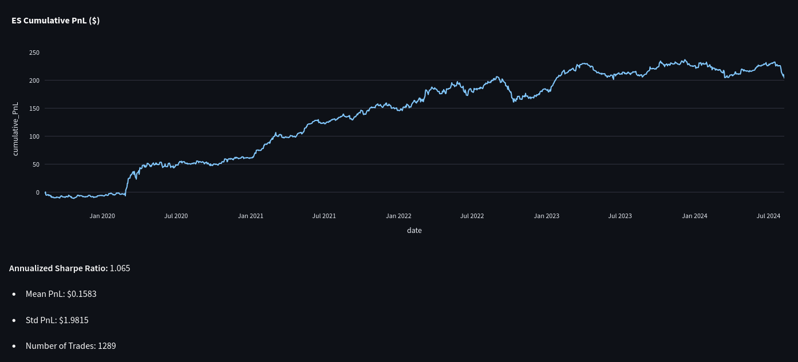
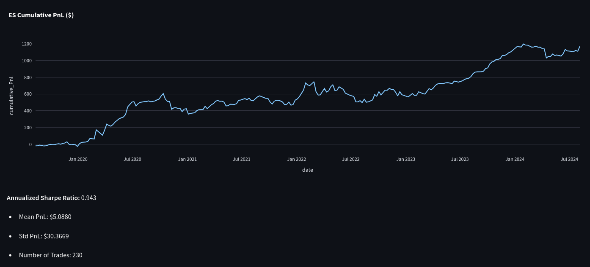

# QuickPnL

**QuickPnL** is a simple, fast tool for backtesting futures trading ideas.
Try the live demo → [quickpnl.streamlit.app](https://quickpnl.streamlit.app/)

## What is QuickPnL?

QuickPnL helps you quickly evaluate how trading strategies would have performed on S&P 500 (ES), Nasdaq (NQ), or the NQ - ES spread over the past 5 years.

With just a few clicks, you can:
- Filter for specific macro dates (e.g., CPI, NFP, monthly expiry)
- Select intraday windows (e.g., 9:30 to 10:00 AM EST)
- Choose long or short positions
- Instantly see performance metrics: Sharpe ratio, cumulative PnL, and more

It’s a tool designed for validating directional or relative value hypotheses with real historical data.

## Demo: Testing a Hypothesis

Let’s say you have a real-world idea you want to test:

> "When Fed Chair Jerome Powell begins speaking at FOMC press conferences, the market reacts with optimism and tends to tick up."

With QuickPnL, you can:

- Select only FOMC days using a preloaded event filter
- Choose a start time of 2:30 PM ET, when Powell typically begins speaking
- Backtest a simple 15-minute long position, capturing the initial market reaction
- Instantly see the historical Sharpe ratio and cumulative PnL

Here’s what that might look like in action:


The outcome?

> **Sharpe Ratio: 0.75** over 29 trades: a solid starting point.

It’s not a definitive result, given the relatively small number of trades, but it suggests there may be some underlying signal in the idea.

More importantly, this example highlights how QuickPnL helps you go from a **market hypothesis to a concrete historical result** — in a matter of seconds.

## Additional Examples

Here are a few other promising strategies I found myself using QuickPnL, each with a Sharpe ratio around 1.0.

I’ve intentionally left out the parameters, but feel free to reach out if you're curious.





A Sharpe of 1.0 isn’t exceptional, but it’s meaningful.  
Stronger edges typically require more sophistication and are often already competed out.

## What This Tool Is and Isn't

QuickPnL helps test whether a trading hypothesis has any measurable historical signal. Nothing more, nothing less.

It doesn’t model execution, slippage, or risk. It won’t tell you what’s tradable or profitable on its own, and it’s very easy to overfit if you’re not careful.

QuickPnL is built for hypotheses that come from real-world reasoning — macro, structure, or intuition — not from over-optimization. 
It’s a sanity checker, not a strategy builder.

## Future Work

- Add support for risk-free rate in Sharpe calculation  
- Improve documentation and code structure  
- Use more granular and up-to-date futures data (currently Aug 2019–Aug 2024)  
- Extend to option-based strategies once I find the right dataset  

This project was originally meant to backtest simple option strategies. I’m still looking for accessible, high-quality options data.

## How to Run Locally
Clone the repo and install dependencies. Consider using a python virtual environment:
```bash
git clone https://github.com/dzhou8/QuickPnL.git
cd QuickPnL
python -m venv venv
source venv/bin/activate
pip install -r requirements.txt
```

Start the streamlit app:
```bash
streamlit run app.py
```
and it should open up as http://localhost:8501 on your browser


